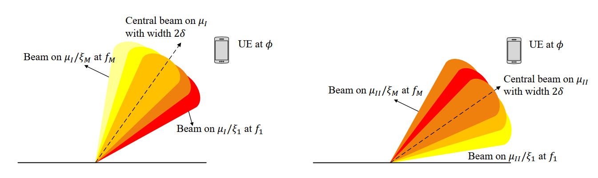
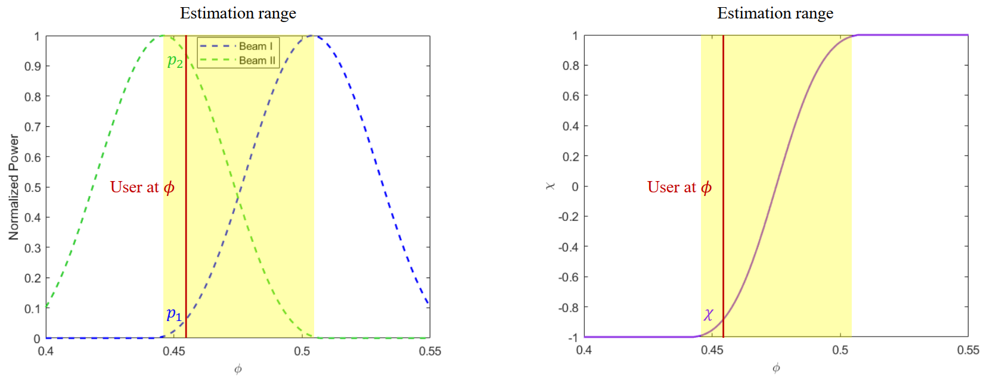

<b>Analyze the specific pattern of the wideband effect in RIS-assisted wideband THz systems. Design a beam training framework by exploiting this effect rather than overcoming it.</b>

##

Terahertz (THz) communications have been considered as one of the promising technologies for future 6G wireless systems. In order to cope with the high path loss in THz systems, reconfigurable intelligent surface (RIS) composed of low-complexity reflecting elements has been proposed to improve the spectrum and energy efficiency by generating directional beams. In order to acquire the direction of user equipment (UE) to send directional beams, the acquisition of accurate channel state information (CSI) is very important. Beam training is widely utilized to acquire the CSI. 

However, existing beam training frameworks have not taken the wideband beam split effect into consideration, so the beam training accuracy decreases a lot in wideband scenarios. To solve the problems mentioned above, we propose an analytical beam training framework in RIS-assisted wideband THz communication systems. 

Specifically, we first analyze the power distribution pattern (PDP) in RIS-assisted wideband THz systems and propose a PDP based direction estimation scheme, where the exact value of the received power can be utilized to analytically calculate the direction. Then, we design the analytical codebook for the proposed framework based on the inherent parameters of the wideband THz system. The proposed framework can achieve the near-optimal achievable rate performance with a lower beam training overhead.