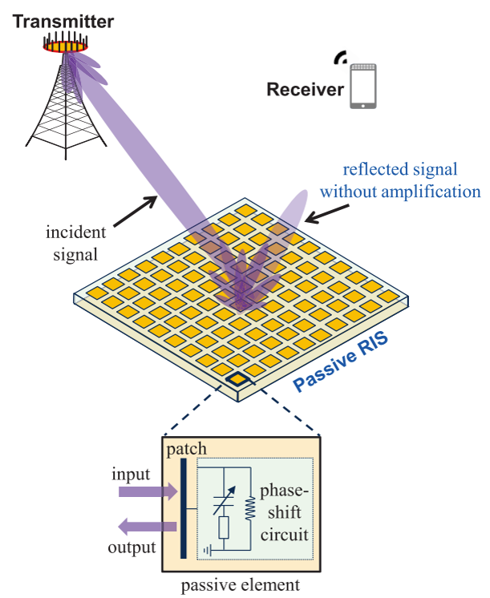

<b>Propose a beam training framework in RIS systems based on the idea of channel coding to enhance the beam training accuracy. Apply the 4-ary code in the design of the framework.</b>

In RIS-assisted communication systems for future sixth-generation (6G) communications, codebook-based beam training stands out as a promising technology to acquire channel state information (CSI). Despite their effectiveness, when the pilot overhead is limited, existing beam training methods suffer from significant achievable rate degradation for remote users with low signal-to-noise ratio (SNR). Due to the "multiplicative fading" effect in RIS systems, the beam training accuracy is severely limited.

To tackle this challenge, leverging the error-correcting capability of channel codes, we introduce channel coding theory into hierarchical beam training to extend the coverage area. Specifically, we establish the duality between hierarchical beam training and channel coding. According to the cascaded channel of RIS systems, the hierarchical beam training in RIS systems can be abstracted as a series of 4-ary code. Then, we design the coded beam training framework based on 4-ary codes, during which the beam encoding and decoding processes are refined respectively to better accommodate to the beam training problem. Simulation results have demonstrated that, the proposed coded beam training method can enable reliable beam training performance for remote users with low SNR with a low beam training overhead.

