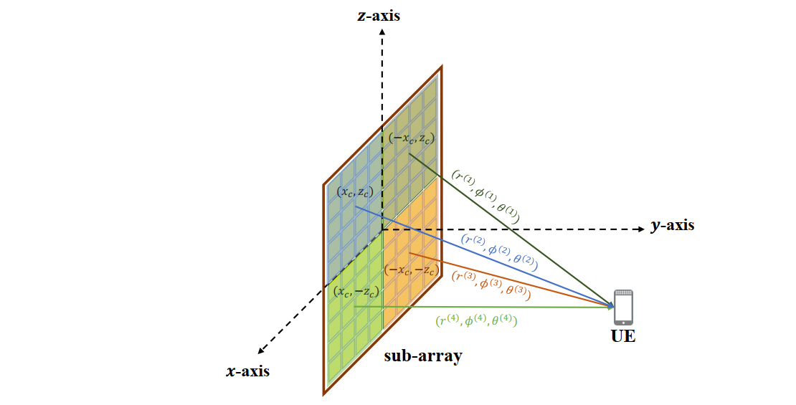

<b>Extend the GTBC to the RIS scenario to deal with the spatial non-stationarity. Design a dynamic codebook to represent the cascaded near-field channel in XL-RIS systems effectively.</b>

For meeting the high requirement of system capacity in future 6G communications, reconfigurable intelligent surface (RIS) is more likely to develop into extremely large-scale RIS (XL-RIS). In XL-RIS systems, precise channel state information (CSI) is the prerequisite of efficient beamforming. Existing channel estimation schemes are mostly based on the spatial stationary assumption. However, with the enlarging array aperture of XL-RIS, spatial non-stationary effect naturally exists, which cannot be captured by most existing schemes and causes a significant degradation in the channel estimation accuracy. What's more, the large array aperture makes the users more likely to be located in the near-field region, resulting an unbearable codebook size.

To address these problems, we study the channel estimation for XL-RIS assisted communication systems in the more realistic non-stationary regime. Specifically, we first extend the GTBC to RIS systems and propose a GTBC based RIS decoupling scheme to convert the entire spatial non-stationary channel into a series of spatial stationary sub-channels. The proposed scheme is realized by artificially creating the time-domain relevance and exploit it to recognize the spatial non-stationary effect in the space domain. 

Based on the decoupled signals, a GTBC-based dynamic orthogonal matching pursuit (GD-OMP) algorithm is proposed to update the dictionary matrix and estimate each path iteratively based on the geometric constraints among RIS sub-arrays. Simulation results verify that the proposed algorithm can capture the spatial non-stationary effect and achieve improved estimation accuracy compared to existing schemes.

