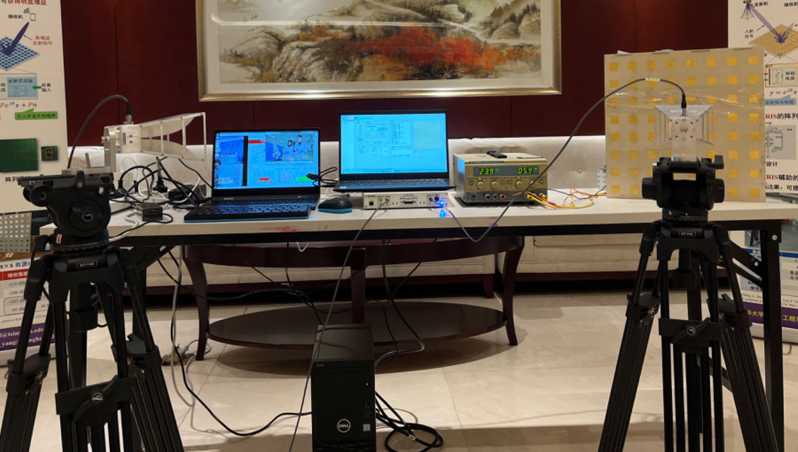
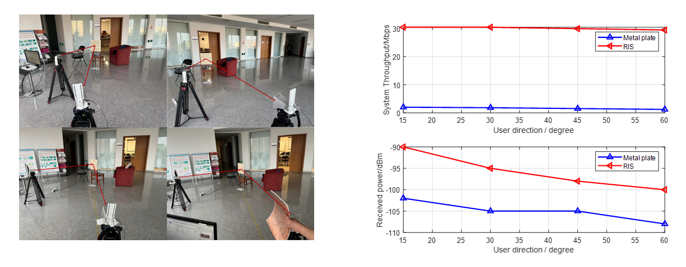

<b>This prototype integrates an 64-element active RIS.</b>

To overcome the “multiplicative fading” effect in RIS systems, we deploy a 64-element active RIS in the prototype to reflect and enhance the incident signals.

## Field test

We conduct field test based on the prototype and verify the performance of the active RIS.

